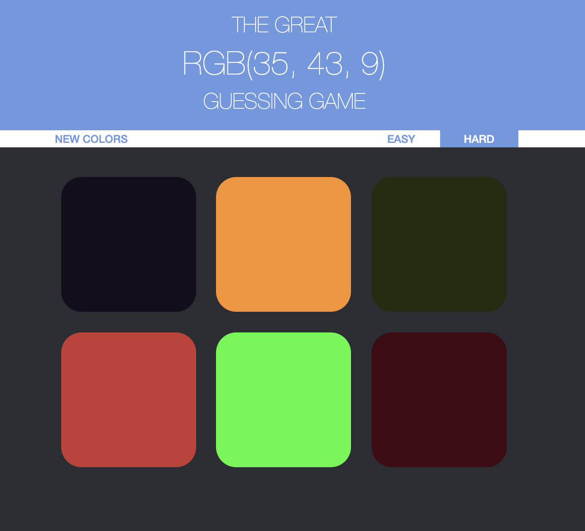

# color-game-project
> An RGB color guessing game

## Table of contents
* [General info](#general-info)
* [Screenshots](#screenshots)
* [Technologies](#technologies)
* [Setup](#setup)
* [Features](#features)
* [Status](#status)
* [Inspiration](#inspiration)
* [Contact](#contact)

## General info
This project manipulates different HTML components using JS

## Screenshots

## Technologies
* Sass
* Javascript

## Setup
[Click here to go to website](https://minyaotan.github.io/color-game-project)

## Features
* Reset colors
* Difficulty levels
* Eliminate color of wrong guesses in view

## Status
Project is finished.

## Inspiration
The game idea is from the Web Developer Bootcamp course in Udemy

## Contact
Created by [CherylTan](https://www.linkedin.com/in/cheryl-tan-72176684/) - feel free to contact me!
